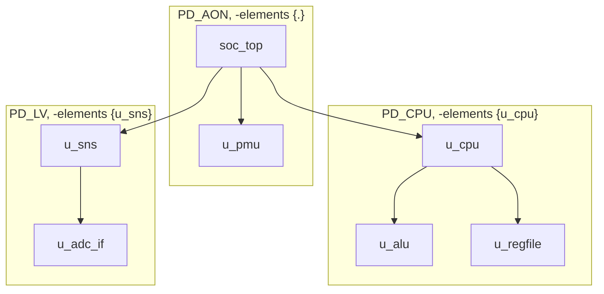

# 2.1 Power domains

Section 2: UPF power-aware design · [Course index](../README.md)

## Key takeaways

- A power domain is a group of instances that share one primary supply, so
  they power down, power up and change voltage together.
- `create_power_domain` builds a domain from instances: `-elements {.}` takes
  the current scope itself, `-elements {u_x}` takes named child instances.
- Every instance ends up in exactly one domain. An instance nobody names
  inherits its parent's domain; naming a child in a new domain carves that
  subtree out.
- Names resolve against the current scope set by `set_scope`, and the domain
  itself is created in that scope.
- Boundaries between domains are where the primary supply changes, so that is
  where isolation cells and level shifters go.

## Notes

### Why domains exist

Different parts of a chip need different power treatment. A CPU core can be
switched off between bursts of work, the controller that wakes it up must stay
on, and a sensor hub can run at a lower voltage to save energy. UPF captures
this by grouping instances that are powered the same way into a **power
domain**. All instances in a domain share one primary supply, so the domain,
not the individual gate, is what gets switched off or run at a different
voltage.

Domains are defined on the logic hierarchy, meaning module instances in the
RTL. Implementation tools later give each domain its own physical region and
power rails. `create_power_domain` only defines membership; supplies,
switches and low-power cells come in later lectures.

### Building domains with `create_power_domain`

The course splits a DUT into three domains: one for the DUT's top level and
one each for its CPU and video blocks. The same pattern on the toy SoC:

```tcl
create_power_domain PD_AON -elements {.}
create_power_domain PD_CPU -elements {u_cpu}
create_power_domain PD_LV  -elements {u_sns}
```



`u_alu`, `u_regfile` and `u_adc_if` are illustrative children. None of them is
named in the UPF, yet each one lands in its parent's domain.

| Option | Selects |
| --- | --- |
| `-elements {.}` | The current scope itself, plus every descendant no other domain claims |
| `-include_scope` | The same as `-elements {.}`; older syntax, used in the course |
| `-elements {u_cpu u_sns}` | The named children and their descendants, but not the current scope itself |

### Which domain an instance belongs to

| Rule | Meaning |
| --- | --- |
| Exactly one domain | The design top and every instance below it must each be in exactly one domain; naming the same instance in two domains is an error |
| Inheritance | An instance nobody names joins its parent's domain, so `u_cpu/u_alu` is in `PD_CPU` |
| Carving out | Naming a child in a new domain takes that subtree out of its parent's domain: `u_cpu` is in `PD_CPU` even though `soc_top` is in `PD_AON`. A domain created with `-atomic` cannot be carved |
| Scoped names | Element names are relative to the current scope |

### Moving around with `set_scope`

The course's example opens with `set_scope dut`. That makes the DUT instance
the current scope, so `cpu` and `video` mean `dut/cpu` and `dut/video`, and
all three domains are created inside `dut`.

| Command | New current scope |
| --- | --- |
| `set_scope u_cpu` | The child instance `u_cpu` |
| `set_scope ..` | The parent of the current scope; an error at the design top |
| `set_scope /` | The design top instance |
| `set_scope .` | Unchanged |

Two ways to give `u_cpu` its own domain:

```tcl
# From soc_top, name the child
create_power_domain PD_CPU -elements {u_cpu}

# Or step into the child and take the scope itself
set_scope u_cpu
create_power_domain PD_CPU -elements {.}
set_scope ..
```

Both put `u_cpu` and everything below it in the domain. They differ in where
the domain lives: the second form creates it inside `u_cpu`, so from
`soc_top` its name is `u_cpu/PD_CPU`.

### Domain boundaries

An instance whose parent is in a different domain is a **boundary instance**,
and its ports are where two domains meet. In the toy SoC, the ports of `u_cpu`
are, seen from inside, the **upper boundary** of `PD_CPU` and, seen from
`soc_top`, part of the **lower boundary** of `PD_AON`. The same holds for
`u_sns` and `PD_LV`.

Every signal that crosses a boundary changes primary supply, which is why
later lectures attach low-power cells there: isolation on the outputs of
`u_cpu` because `PD_CPU` can be off, and level shifters on the ports of
`u_sns` because `PD_LV` runs at 0.7 V.

## UPF example

UPF 2.1 or later, loaded with `soc_top` as the current scope:

```tcl
upf_version 2.1

create_power_domain PD_AON -elements {.}
create_power_domain PD_CPU -elements {u_cpu}
create_power_domain PD_LV  -elements {u_sns}
```

| Domain | Extent |
| --- | --- |
| `PD_AON` | `soc_top` and `u_pmu` |
| `PD_CPU` | `u_cpu` and everything below it |
| `PD_LV` | `u_sns` and everything below it |

The domains have no supplies yet; lectures 2.2 and 2.3 add them.

## DV angle

- **Domain membership decides what gets corrupted.** When a domain's primary
  supply turns off in power-aware simulation, the registers and logic outputs
  in its extent go to X. A block placed in the wrong domain either keeps
  running while its domain is off, which hides missing isolation, or dies in a
  state where it should be alive.
- **Check the extents first.** After elaboration, read the tool's power domain
  report and confirm every block sits in the domain the power spec intends.
  Isolation, level shifting and retention checks all build on this partition.
- **Boundaries define the crossing list.** Static low-power checkers derive
  every domain crossing from the extents, then look for isolation and level
  shifting on each one. A wrong extent gives a wrong crossing list, and
  missing-cell bugs go unreported.
- **Keep the testbench outside the domains.** The simulator applies the UPF
  from a chosen design top, normally the DUT, so testbench drivers and
  monitors are never corrupted. A testbench placed inside a domain loses its
  stimulus whenever that domain powers off.

## Beyond the course

- **`-include_scope` is gone from current UPF.** It is not part of
  `create_power_domain` in IEEE 1801-2015 (UPF 3.0) or later; new UPF writes
  `-elements {.}`. Older files and tutorials still use it.
- **The full option list in IEEE 1801-2018 (UPF 3.1):**

  | Option | Purpose |
  | --- | --- |
  | `-elements` | Instances to include; `.` is the current scope |
  | `-exclude_elements` | Instances to drop from the `-elements` list |
  | `-atomic` | Fixes the domain's minimum extent, so no later command can carve it up (UPF 2.1) |
  | `-supply {handle [supply_set]}` | Declares a supply set handle such as `primary`; covered in lecture 2.3 |
  | `-available_supplies` | Extra supply sets that implementation may use to power cells it inserts in the domain, such as buffers (UPF 2.1) |
  | `-boundary_supplies` | Extra supply sets for cells inserted at the domain boundary (UPF 3.1) |
  | `-subdomains` | Makes the domain a container of existing domains, equivalent to `create_composite_domain` |
  | `-define_func_type` | Connects pins with the listed Liberty `pg_type` values to a function of the domain's primary supply set automatically |
  | `-update` | Adds to a domain that already exists |

- **`-atomic` protects verified IP.** An IP vendor marks the IP's domain
  atomic so an integrator cannot carve a piece of it into another domain,
  which would invalidate the IP-level power verification. Sub-domains the IP
  does need are set aside with `-exclude_elements` and given their own atomic
  domains.
- **UPF 4.0 tightened the precedence rule:** when commands name different
  ancestors of an instance, the command naming the lower ancestor applies.
- **Domains are logical but shape the floorplan.** Placement must keep each
  domain's cells where that domain's supplies are routed, so the hierarchy
  chosen for domains carries into physical design.

## Gotchas

- **A backslash continues a line only when it is the last character.** In
  `create_power_domain PD_CPU \` followed by a stray space, the command ends
  at that line and the next line (`-elements {u_cpu}`) runs as a command of
  its own and fails. Joining the lines but leaving `\ ` in the middle, which
  is easy when copying from slides, hands the tool ` -elements` with a leading
  space as one argument, and it rejects it.
- **`set_scope .` does not go back to the top.** It leaves the scope
  unchanged; use `set_scope /` for the design top or `set_scope ..` for the
  parent. Scope also persists, so forgetting to move back makes every later
  name resolve against the wrong instance.
- **A domain is created in the current scope.** After `set_scope u_cpu`, a new
  domain is referred to as `u_cpu/PD_...` from `soc_top`.
- **Multi-element domains can add isolation you didn't intend.** If sibling
  instances `A` and `B` form one domain with `-elements {A B}`, a signal from
  `A` to `B` leaves the domain at a port of `A` and re-enters at a port of
  `B`, so an output isolation rule on that domain isolates a path that never
  changes supply. Align domains with the hierarchy by wrapping `A` and `B` in
  one instance, or filter the isolation strategy with `-diff_supply_only` or
  `-source`/`-sink`.
- **Every instance needs a domain.** Leave out the top-level
  `-elements {.}` domain and the design top, plus everything not carved out
  of it, has no domain, which is an error.

## Interview questions

- **What is a power domain?** A group of instances that share one primary
  supply, so they power up, power down and change voltage together.
- **How do `-elements {.}` and `-elements {u_cpu}` differ?** `{.}` includes
  the current scope and its descendants; `{u_cpu}` includes only the named
  child and its descendants, not the current scope.
- **`u_cpu` is in `PD_CPU` and nothing names `u_cpu/u_alu`. Which domain is
  `u_alu` in?** `PD_CPU`; an instance nobody names inherits its parent's
  domain.
- **Can one instance be in two power domains?** No. A child can be carved out
  of its parent's domain into a new one, but every instance ends up in exactly
  one.
- **What does `-atomic` do, and who uses it?** It stops any later command from
  carving part of the domain into another domain; IP vendors use it to keep a
  block that was verified as one domain intact.
- **Why do power domain boundaries matter for verification?** The primary
  supply changes there, so every signal crossing a boundary has to be checked
  for isolation and level shifting.
- **Why align power domains with the module hierarchy?** Boundaries then fall
  on module ports, which keeps crossings clean and avoids the extra isolation
  that multi-element domains cause.
