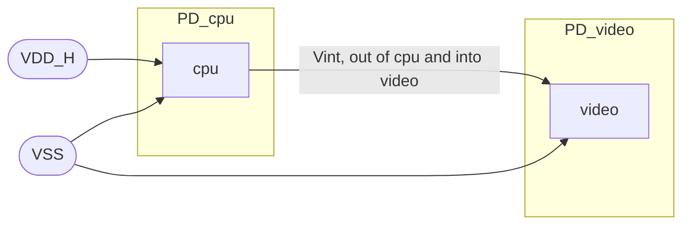
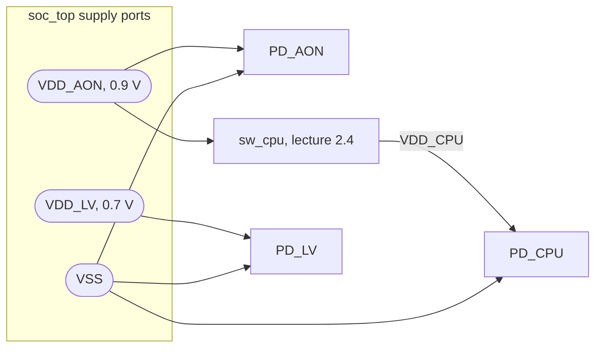

# 2.2 Supply nets and ports

Section 2: UPF power-aware design · [Course index](../README.md)

## Key takeaways

- UPF describes the power supply network with **supply ports** (connection
  points on an instance), **supply nets** (the wires) and
  `connect_supply_net` (which ties nets to ports).
- A supply does not carry 0 or 1. It carries a state, `FULL_ON`,
  `PARTIAL_ON`, `OFF` or `UNDETERMINED`, plus a voltage.
- A port's direction sets which way that state flows: `in` brings an outside
  supply into the instance, `out` exports one generated inside it.
- Creating and connecting nets powers nothing by itself. A domain is powered
  only by the nets bound to its primary supply.
- The course's `-domain` and `-reuse` options are UPF 1.0-era style; UPF 4.0
  lists them as legacy or deprecated.

## Notes

### Why UPF needs a supply network

RTL has no power pins: every gate is implicitly powered, all the time. UPF
adds the missing power wiring as a separate network laid over the logic
hierarchy, so a simulator can tell which logic is powered and at what voltage.

| Object | Role | Command |
| --- | --- | --- |
| Supply port | A connection point for a supply on an instance, such as a chip's `VDD` pin | `create_supply_port` |
| Supply net | A wire that carries a supply from its source to its loads | `create_supply_net` |
| Connection | Ties a net to one or more ports | `connect_supply_net` |
| Power switch | Derives a switchable net from an always-on one; lecture 2.4 | `create_power_switch` |

### What a supply carries

Every supply port and net holds a state and a voltage. The testbench sets them
on the top-level ports, and the simulator propagates them through the
connected nets in the same time step as logic values.

| State | Meaning |
| --- | --- |
| `FULL_ON` | On at its voltage; logic powered by it works normally |
| `OFF` | Off; logic powered by it is corrupted |
| `PARTIAL_ON` | Partly on, typically a net fed by several switches of which only some are on |
| `UNDETERMINED` | An error state, for example a power switch whose controls are in an illegal combination |

### Supply ports

`create_supply_port` puts a port on an instance: on the current scope, or,
with `-domain`, in the scope where that domain was created. The inside of a
port is its **LowConn** and the outside its **HighConn**. `-direction`
decides which way the supply state travels through it:

| Direction | State flows | Typical use |
| --- | --- | --- |
| `in` (default) | From the outside net into the instance | Chip supply pins, or a block receiving its supply |
| `out` | From the inside net out of the instance | A block that generates a supply, such as a switch or regulator output |
| `inout` | Both ways | Connecting resolved nets that have several drivers |

### Supply nets

`create_supply_net` creates a net in the current scope, or, with `-domain`,
in that domain's scope.

- `-reuse` makes a net that already exists available in another domain,
  instead of creating a second net with the same name.
- `-resolve` chooses how the net combines several drivers: `unresolved` (the
  default, one driver only), the built-in `one_hot`, `parallel` and
  `parallel_one_hot`, or a user-written resolution function.

`connect_supply_net` then ties a net to ports. Giving a net the same name as
the port it connects to, as in `connect_supply_net VDD -ports VDD`, is the
usual convention.

### The course example

The course's CPU block receives a high supply `VDD_H` and ground `VSS`, and
produces an internal supply `Vint` that it hands to the video block:



- **Ports:** `VDD_H` and `VSS` for `PD_cpu`, `VSS` for `PD_video`, and `Vint`
  twice: an output for `PD_cpu` and an input for `PD_video`.
- **Nets:** `VDD_H` for `PD_cpu`, and `Vint` for `PD_cpu`, extended to
  `PD_video` with `-reuse` so both domains share one net.
- **Connections:** `connect_supply_net` ties each net to the port of the same
  name.

## UPF example

The toy SoC's supply network, loaded at `soc_top` after the domains from
lecture 2.1. It uses the current style, with no `-domain`:



```tcl
upf_version 2.1

# The chip's supply pins, on soc_top
create_supply_port VDD_AON
create_supply_port VDD_LV
create_supply_port VSS

create_supply_net VDD_AON
create_supply_net VDD_LV
create_supply_net VSS
create_supply_net VDD_CPU    ;# driven by sw_cpu, added in lecture 2.4

connect_supply_net VDD_AON -ports VDD_AON
connect_supply_net VDD_LV  -ports VDD_LV
connect_supply_net VSS     -ports VSS

# UPF 1.0 style; lecture 2.3 replaces this with supply sets
set_domain_supply_net PD_AON -primary_power_net VDD_AON -primary_ground_net VSS
set_domain_supply_net PD_CPU -primary_power_net VDD_CPU -primary_ground_net VSS
set_domain_supply_net PD_LV  -primary_power_net VDD_LV  -primary_ground_net VSS
```

The ports need no `-direction`: all three are inputs, the default.

## DV angle

- **The testbench powers the chip through its supply ports.** It calls the
  UPF package's `supply_on()` with a port's path and a voltage, for example
  `supply_on("/tb/u_soc/VDD_AON", 0.9)`, which drives the port `FULL_ON` at
  0.9 V; `supply_off()` turns it off. Everything inside follows through the
  connected nets. Lecture 3.3 covers this in depth.
- **An all-X block from time zero usually means a supply bug.** A domain whose
  primary supply never reaches `FULL_ON` stays corrupted for the whole test.
  Check the supply connections before debugging the RTL.
- **Static checks catch network mistakes early.** Static low-power checkers
  flag supply ports left unconnected, nets with no driver, several drivers on
  an unresolved net, and domains whose primary supply was never bound. These
  are cheap to fix at RTL and expensive after layout.

## Beyond the course

- **`set_domain_supply_net` is legacy.** IEEE 1801-2015 and later mark it so.
  It is equivalent to creating a supply set with `power` and `ground`
  functions and associating it with the domain's `primary` handle, which is
  the style lecture 2.3 teaches.
- **UPF 4.0 lists `-domain` (on `create_supply_port` and `create_supply_net`)
  and `-reuse` as legacy or deprecated.** Current style creates ports and nets
  in the current scope, moving there with `set_scope` when they belong on a
  child instance, and groups nets into supply sets.
- **You rarely need ports at every level.** `connect_supply_net` creates
  whatever ports and nets it needs to route a supply down the hierarchy, and a
  domain's primary supply reaches every instance in its extent automatically.
  Explicit ports matter at boundaries that are implemented separately, such
  as hard macros.
- **`connect_supply_net` can also connect by pin type.** `-pg_type`, together
  with `-elements`, `-cells` or `-domain`, connects the net to every pin with
  a given power or ground type, for example the supply pins of all memory
  macros.
- **Supply ports and nets can be declared in HDL.** A SystemVerilog or VHDL
  port or net of the UPF package's `supply_net_type` counts as a supply port
  or net, exactly as if it had been created in UPF.

## Gotchas

- **Write `-direction out`, not `output`.** The standard defines `in`, `out`
  and `inout`.
- **`-domain` places a port in the domain's scope, not on its instances.** If
  `PD_CPU` was created from `soc_top` with `-elements {u_cpu}`, then
  `create_supply_port VDD -domain PD_CPU` creates `soc_top/VDD`, not
  `soc_top/u_cpu/VDD`. To put a port on the block itself, `set_scope u_cpu`
  and create it there. By the same rule, two same-named `-domain` ports for
  domains created in the same scope name the same port twice.
- **A second `create_supply_net` with the same name needs `-reuse`.** Without
  it, the command tries to create a net that already exists in that scope.
- **Creating supply objects connects nothing.** A net is attached only through
  `connect_supply_net`, a domain's primary supply or a switch output. Until
  then it has no effect on any domain, and static checks flag it as unused.

## Interview questions

- **What is the difference between a supply port and a supply net?** A port
  is a connection point on an instance boundary; a net is the wire that
  carries the supply between ports and to the logic.
- **What value does a supply carry in power-aware simulation?** A state
  (`FULL_ON`, `PARTIAL_ON`, `OFF` or `UNDETERMINED`) plus a voltage.
- **When is a supply port `-direction out`?** When the block generates a
  supply inside itself, such as a power switch or regulator output, and
  exports it to other blocks.
- **What does `create_supply_net -reuse` do?** It makes an existing net
  available in another domain instead of creating a new one; UPF 4.0 lists it
  as legacy or deprecated.
- **What does `-resolve` control on a supply net?** How state and voltage are
  computed when the net has more than one driver, such as several power
  switches; the default, unresolved, allows only one driver.
- **How does a testbench turn a supply on in power-aware simulation?** It
  calls the UPF package's `supply_on()` on a top-level supply port with a
  voltage, and `supply_off()` to turn it off.
- **You created and connected supply nets but defined nothing else. Which
  domains are powered?** None yet; a domain is powered only by the nets bound
  to its primary supply.
