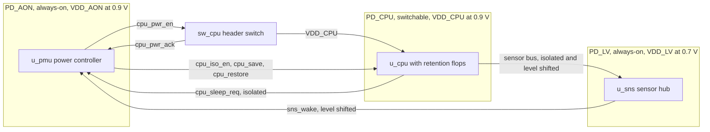

# UPF Power-Aware Design & Verification Notes

Study notes on IEEE 1801 Unified Power Format (UPF), written while taking
Robin Garg's Udemy course
[UPF Power Aware Design & Verification](https://www.udemy.com/course/upf-power-aware-design-verification/).
Each lecture is rewritten in my own words, then extended with how the topic is
verified, what changed in newer editions of the standard, and worked UPF
examples.

> These are personal study notes, not affiliated with or endorsed by the
> instructor or Udemy. No slides, video, or transcript from the course is
> reproduced here; the explanations, diagrams, and UPF examples are original.

## Progress

The checklist follows the course's public outline. Each item links to its note
once written.

### Section 1: Need of UPF and UPF basics

- [ ] 1.1 VLSI design phases
- [ ] 1.2 RTL simulation vs power-aware UPF simulation
- [ ] 1.3 UPF basics

### Section 2: UPF power-aware design

- [x] [2.1 Power domains](02-power-aware-design/01-power-domains.md)
- [ ] 2.2 Supply nets and ports
- [ ] 2.3 Supply sets
- [ ] 2.4 Power switches
- [ ] 2.5 Power state table
- [ ] 2.6 Level shifters
- [ ] 2.7 Isolation cells
- [ ] 2.8 Input vs output isolation cells
- [ ] 2.9 Retention cells
- [ ] 2.10 Flat UPF vs hierarchical UPF
- [ ] 2.11 UPF evolution: 1.0 vs 2.0 vs 2.1 vs 3.0

### Section 3: UPF power-aware verification

- [ ] 3.1 Popular power-saving techniques
- [ ] 3.2 Static verification
- [ ] 3.3 Dynamic verification 1: controlling power supplies
- [ ] 3.4 Dynamic verification 2: simstate modeling
- [ ] 3.5 Dynamic verification 3: power coverage
- [ ] 3.6 Dynamic verification 4: low-power assertions

### Section 4: Miscellaneous concepts

- [ ] 4.1 Instrumentation vs instantiation
- [ ] 4.2 Hard macros and Liberty files

## Reference

- [UPF command cheat sheet](reference/upf-commands.md)
- [Glossary](reference/glossary.md)

## How each note is laid out

Every note uses the same sections and leaves out any with nothing to say.

| Section | Contents |
| --- | --- |
| Key takeaways | 3 to 5 bullets for quick revision |
| Notes | The lecture content in my own words, with tables and diagrams |
| UPF example | A snippet written against the toy SoC below, labeled with the UPF version it needs |
| DV angle | How the topic is verified: power-aware simulation, static checks, assertions, coverage |
| Beyond the course | Changes in IEEE 1801-2018 and 1801-2024, industry practice, tool behavior |
| Gotchas | Common mistakes and traps |
| Interview questions | Likely questions, each with a one-line answer |

## Toy SoC used in the examples

All UPF snippets describe the same small SoC, so each lecture adds to one
design instead of starting from scratch.

| Domain | Instance | Supply | Behavior | Low-power cells it needs |
| --- | --- | --- | --- | --- |
| `PD_AON` | Top level `soc_top`, including `u_pmu` | `VDD_AON`, 0.9 V | Always on | None; it hosts the power controller |
| `PD_CPU` | `u_cpu` | `VDD_CPU`, switched from `VDD_AON` by `sw_cpu` | Switchable | Power switch, output isolation, retention |
| `PD_LV` | `u_sns` | `VDD_LV`, 0.7 V | Always on, lower voltage | Level shifters on every crossing to or from 0.9 V |

- All domains share the ground net `VSS`.
- `u_pmu` sequences `PD_CPU` through `cpu_pwr_en` and `cpu_pwr_ack` (switch
  control and acknowledge), `cpu_iso_en` (clamps the `u_cpu` outputs), and
  `cpu_save` / `cpu_restore` (retention).
- While `PD_CPU` is off, its retention flops hold their state on `VDD_AON`.
- Signals from `u_cpu` to `u_sns` need both isolation and level shifting: they
  leave a switchable domain and cross from 0.9 V to 0.7 V.

Two power states are enough to start; later lectures refine them.

| State | `PD_AON` | `PD_CPU` | `PD_LV` |
| --- | --- | --- | --- |
| `ALL_ON` | On, 0.9 V | On, 0.9 V | On, 0.7 V |
| `CPU_OFF` | On, 0.9 V | Off, state retained | On, 0.7 V |

The snippets follow IEEE 1801 syntax but have not been run through a simulator
or a static checker.

## Newer than the course: UPF 3.1 and 4.0

The course covers UPF up to 3.0. Two newer editions have been published since.

| UPF version | Standard |
| --- | --- |
| 1.0 | Accellera, 2007 |
| 2.0 | IEEE 1801-2009 |
| 2.1 | IEEE 1801-2013 |
| 3.0 | IEEE 1801-2015 |
| 3.1 | IEEE 1801-2018 |
| 4.0 | IEEE 1801-2024, published March 2025 |

Changes that affect these notes:

- **Power state tables are legacy.** `create_pst`, `add_pst_state` and
  `add_port_state` have been legacy since UPF 2.1, replaced by
  `add_power_state`. Wherever the course uses a PST, the note also shows the
  `add_power_state` version.
- **Retention was reworked in 4.0.** The `set_retention` options
  `-save_condition`, `-restore_condition` and `-retention_condition` are now
  legacy and cannot be mixed with their replacements: `-save_event_condition`,
  `-restore_event_condition`, `-powerdown_period_condition` and
  `-restore_period_condition`.
- **New in 4.0:** virtual supply nets, ports and sets (supplies with no
  physical implementation, usable in power states and in `-source`/`-sink`
  filters), refinable macros for soft IP, UPF libraries, and value conversion
  methods (`create_vcm`), which supersede the legacy VCT commands
  `create_hdl2upf_vct` and `create_upf2hdl_vct`.
- Tool support for 4.0 features varies by vendor and release.

## Resources

- [IEEE 1801-2024 standard page](https://standards.ieee.org/ieee/1801/7466/).
  The full standard is free to download through the
  [IEEE GET Program](https://ieeexplore.ieee.org/browse/standards/get-program/page/series?id=80),
  sponsored by Accellera.
- [IEEE 1801 open-source files](https://opensource.ieee.org/upf/1801-2024):
  the standard's SystemVerilog and VHDL UPF packages and its Annex E example
  UPF.
- [Introduction of IEEE 1801-2024 (UPF 4.0) improvements](https://dvcon-proceedings.org/wp-content/uploads/Tutorial_5B_Introduction-of-IEEE-1801-2024-UPF4_0.pdf),
  DVCon tutorial slides.
- [Free Yourself from the Tyranny of Power State Tables with Incrementally Refinable UPF](https://dvcon-proceedings.org/wp-content/uploads/free-yourself-from-the-tyranny-of-power-state-tables-with-incrementally-refinable-upf.pdf),
  DVCon paper on why PSTs became legacy.
- [Low Power Methodology Manual](https://link.springer.com/book/10.1007/978-0-387-71819-4)
  by Keating, Flynn, Aitken, Gibbons and Shi (Springer, 2007): power gating,
  retention and multi-voltage design in practice.
- [Low-Power Design and Power-Aware Verification](https://link.springer.com/book/10.1007/978-3-319-66619-8)
  by Progyna Khondkar (Springer, 2018): UPF-based static and dynamic
  power-aware verification.
